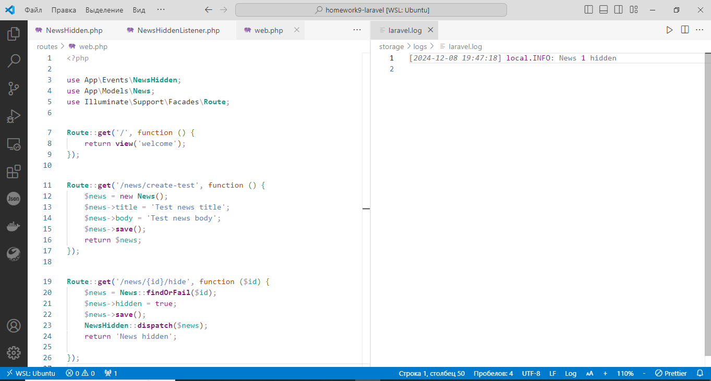
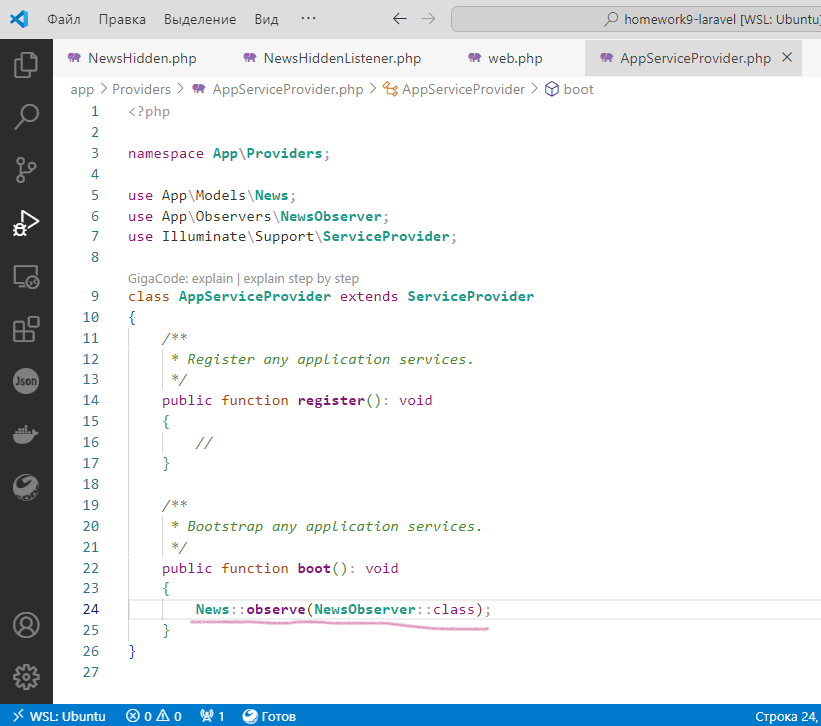
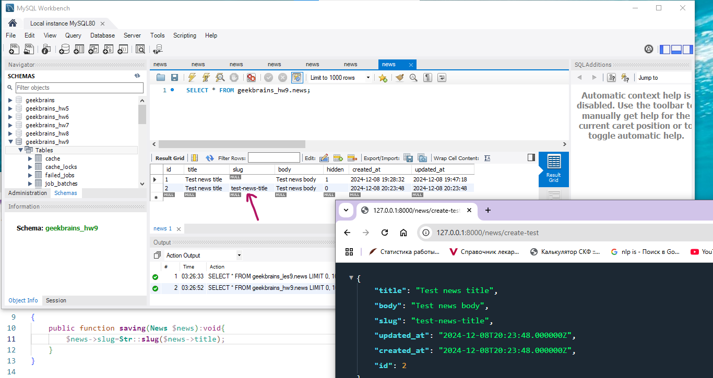

# Laravel. Homework 9. Тогочакова Евгения

Цели практической работы:

Научиться:

— создавать события и вызывать их;
— создавать слушатели и привязывать их к событию;
— применять наблюдатели моделей.

Что нужно сделать:

1. Создайте новый проект Laravel или откройте уже существующий.

2. Создайте новую ветку вашего репозитория от корневой (main или master).

3. Создайте миграцию командой ```php artisan make:migration CreateNewsTable``` 

4. Создайте модель News.

5. Создайте событие NewsHidden и присвойте полю класса $news параметр $news в конструкторе класса.

6. Создайте слушатель NewsHiddenListener, в котором опишите логику слушателя, используя функцию:
```Log::info('News ' . $event->news->id . ' hidden');```

7. Зарегистрируйте событие и слушатель в классе EventServiceProvider.

8. В файле routes/web.php создайте необходимый маршрут '/news/create-test', использующий метод get для создания тестовой новости, и пропишите логику создания тестовой новости.


9. В файле routes/web.php создайте необходимый маршрут, использующий метод get '/news/{id}/hide' для скрытия новости. Измените атрибут is_hidden на значение true. После этой операции вызовите событие NewsHidden с помощью инструкции ```NewsHidden::dispatch($news);```


10. В файле storage/logs/laravel.log проверьте, сработал ли слушатель, в нём должна появиться строка ```News hidden 1```, где 1 — это id скрытой новости (может отличаться). 

11. Создайте класс-наблюдатель NewsObserver.

12. Зарегистрируйте его в файле App\Providers\EventServiceProvider в функции boot.

13. Опишите логику изменения поля slug новости при вызове события saving в наблюдателе NewsObserver с помощью инструкции.

Эта инструкция использует класс Str, который можно подключить с помощью инструкции в начале файла.

14. Создайте ещё одну новость с помощью маршрута '/news/create-test'.

15. Проверьте заполнение поля slug через базу данных. Оно должно выглядеть следующим образом: «test-news-title» (если вы оставили такое же название, как в примере).

16. Сделайте коммит изменений с помощью Git и отправьте push в репозиторий.

